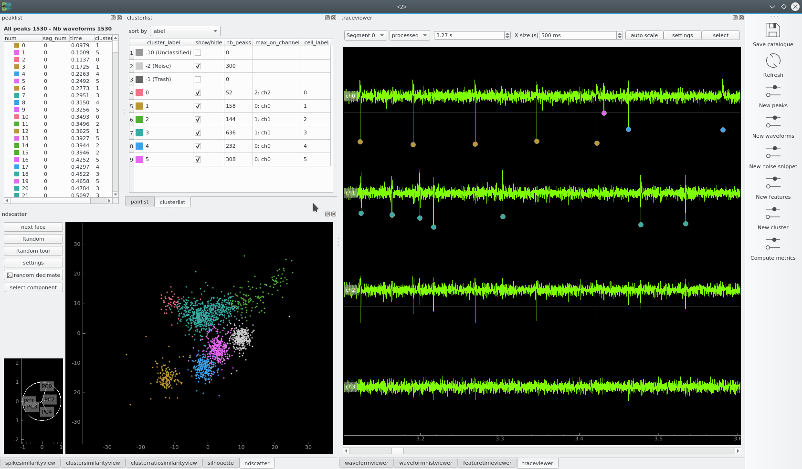
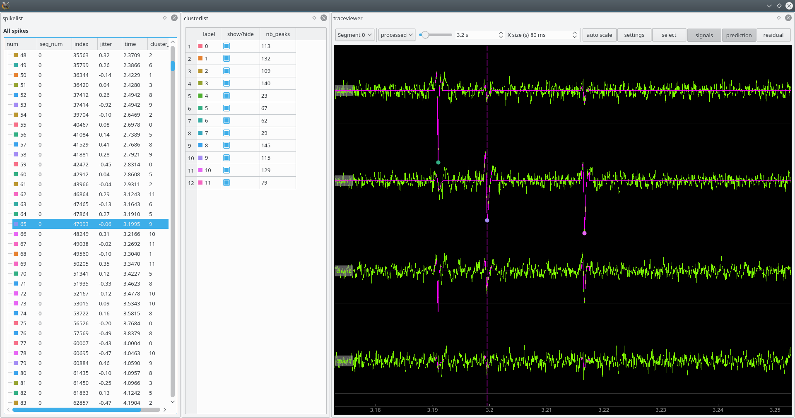

# trisdesclous: spike sorting with a [French touch](https://fr.wikipedia.org/wiki/French_touch_(informatique)).

Authors: Christophe Pouzat and Samuel Garcia

## documentation

The documentation is here: http://tridesclous.readthedocs.io/

## overview

**tris des clous** is a very dishonest translation of **spike sorting** to French.

Pronouce it [tree day clue] in English.

The primary goal of tridesclous was to provide a toolkit to teach good practices in spike sorting techniques.
Trideslcous is now mature and can be used to sort spike on tetrode up to neuropixel probe recorded dataset.

Tridesclous is both:

  * an offline spike sorter tools able to read many file format
  * a realtime spike sorting combined with [pyacq](http://pyacq.readthedocs.io)

## Main features

  * template matching based method
  * several alternative methods at several processing steps of the chain
  * Qt GUI for interactive exploration
  * a simple python API to use in a notebook or to build a custom pipeline
  * support for many data formats (Raw, Blackrock, Neuralynx, Plexon, Spike2, Tdt, OpenEphys, ...) via [neo](https://github.com/NeuralEnsemble/python-neo)
  * hardware acceleration with opencl: both GPU and multicore CPU
  * smaller memory footprint
  * built-in sample datasets to try on
  * quite fast for tetrode datasets -- expect x30 speedup over real time on a simple laptop
  * multi-platform
  * open source based on a true open source stack

The forest of spike sorting tools is dense and *tridesclous* is a new tree.
Be curious and try it.

# Installation

http://tridesclous.readthedocs.io/en/latest/installation.html

# Launch

http://tridesclous.readthedocs.io/en/latest/launch.html

## Screenshots

### Offline Catalogue Window

### offline Peeler Window

### Online Peeler in a pyacq.Node

## Status

