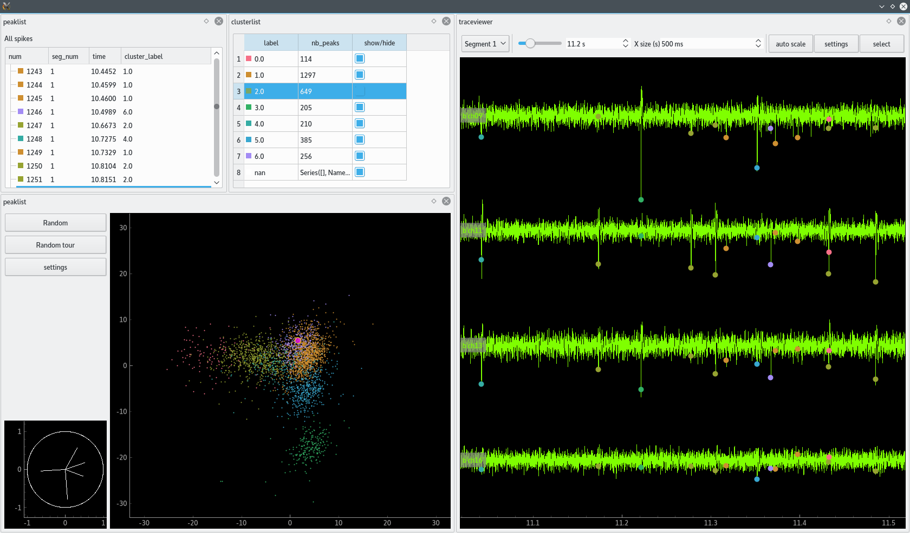

# trisdesclous
Tris Des Clous, french touch spike sorting.

This module provide some functions and examples of spike sorting.
It is our material for learning good practices in spike sorting technics.

You can also use it for your data!!

It is a complete rewrite of our old tools (SpikeOmatic, OpenElectrophy, ...)
with up-to-date (in 2015) python modules to simplify our codes.

tridesclous:
  * should make easy to leave a mark of your spike sorting process in a jupyter notebook.
  * offer a simple UI written in Qt for interactive exploration.

In short, tridesclous force you to write a script for spike sorting but you also benefit of a simple UI.


Dependencies:
  * numpy
  * pandas
  * sklearn
  * scipy
  * matplotlib
  * seaborn
  * tables
  * PyQt4 (for UI only)
  * pyqtgraph (for UI only)


This is in construction so for easy install/update do:
```
git clone https://github.com/tridesclous/tridesclous.git
cd tridesclous
python setup.py develop
```

while tridesclous is not installed but linked, for having new version just do:
```
git pull
```


Authors: Christophe Pouzat and Samuel Garcia


