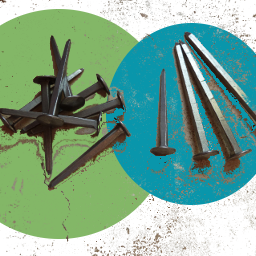

Welcome to tridesclous's documentation!
=======================================

If this is your first time here, after admiring the logo, you should go
in :ref:`overview` and :ref:`step_by_step`.

Contents
========

.. toctree::
    :maxdepth: 1
    
    overview
    installation
    launch
    step_by_step
    catalogue_window
    important_details
    parameters
    realtime
    api
    release_notes.rst

..
    Contents:

    Indices and tables
    ==================

    * :ref:`genindex`
    * :ref:`modindex`
    * :ref:`search`

