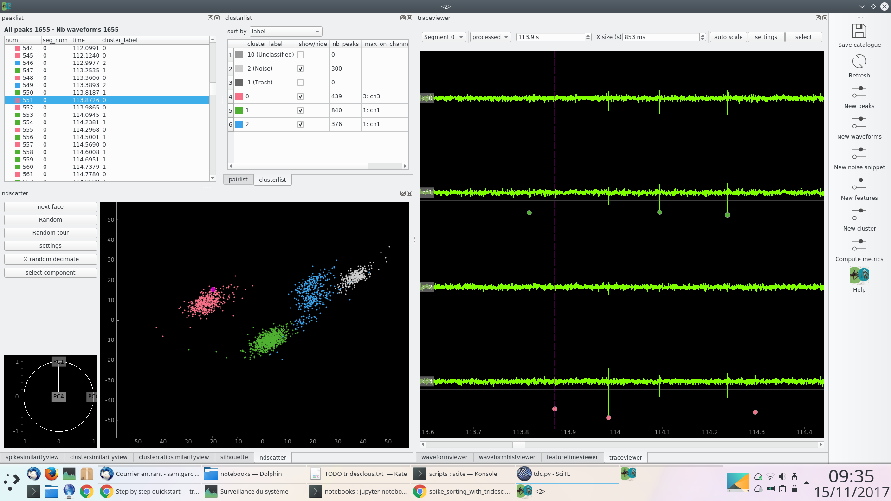
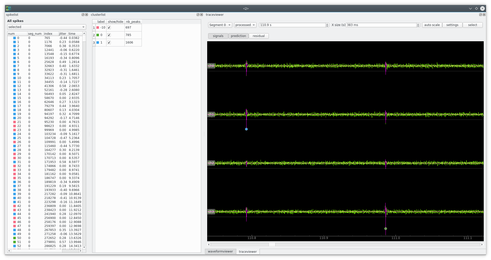

.. _step_by_step:

Step by step quickstart
=======================

Here is a step by step hands on with the user interface.
Mind you, writing a jupyter notebook is a better method to keep track of the spike sorting process.
But the *click and play* approach is prefered for beginners.

Launch
------

In a console (terminal)::
    
    workon tdc (or activate tdc for windows)
    tdc

You have a minimalist window with some icons on the left.

Step 1 - Initialize dataset
---------------------------

This step consists of initializing the datasets and configure everything: number of channels,
probe geometry, number of channel groups.

To do that, normally, you have to click on "Initialize dataset", but for testing purposes you can simply use menu
**"File > download dataset > striatum_rat"**.
This will locally download datasets from https://github.com/tridesclous/tridesclous_datasets and configure everything for you.

After that step some information are displayed about the:
  * DataIO: details about the dataset (nb channel, nb channel group, n segment, sample rate, durations...)
  * CatalogueConstructor: empty for the moment

Here we have a dataset given by David Robbe and Mostafa Safai recorded with a tetrode in sriatum of a rat.
The signal is sampled at 20kHz.

Step 2 - Initialize Catalogue
-----------------------------

This step contains several sub steps to create the catalogue.
This is automatic but needs some parameters.

Click on "Initialize" on parameters dialog popup.
Parameters are organized in sections:
  * duration
  * preprocessor
  * peak_detector
  * noise_snippets
  * extract_waveforms

For complete details on parameters see :ref:`parameters` and :ref:`important_details`.

Then you have to choose a **feature method**. For tetrode **"global_pca"** with 5 component sounds good.
You will be able to change this in catalogueWindow later on.

Then you have to choose a **cluster method**. Here let's choose **"gmm"** (gaussian mixture model) with 3 clusters.

Depending on the dataset and chosen method this can take a while.
Here, it should take around 5 seconds for 300s of signal.

After that step CatalogueConstructor info is updated:
   * nb of detected peaks
   * waveforms shape
   * features shape
   * cluster labels

Step 3 - CatalogueWindow
------------------------------

Click on CatalogueWindow. A window with multi view will help with the manual correction of the auto-catalogue (step 2)

This window contain docks than can be arranged as you want. Some of them are organized in tabs, but you can change.
with drag and drop. You can event close or move some view on another screen.
Righ click on the left toolbar to make them appear again.

On the right toolbar you can manually re-run some sub steps of the previous chain: detect peak, extract waveforms,
extract noise snippets, extract features, cluster.

Main views are:
  * spike list
  * cluster list
  * trace view
  * ndscatter
  * waveform view

For more detail see :ref:`catalogue_window`

All views are linked, this means that when you click somewhere it will update the other views.
For instance, if you select a spike, the trace view will zoom on that spike and the ndscatter
will highlight the spike.

In the trace view you can zoom Y with the mouse wheel and zoom X with right click.

Make visible one by one each cluster [0, 1, 2]. Play with the noise (label -2) and see what happens in each view.

Click on **"random tour"** in ndscatter. It is a dynamic projection that includes many dimensions like in GGobi.
It helps a lot to understand how many clusters we have.

Many views can be customized with a settings dialog. Sometimes, you have to double click on the view, sometimes on a button.
For instance in **waveformhistviewer** you can choose the *colormap* and the *binsize* with a double click in the black area.

In **pairlist**, select each pair and see what happens on  **waveformhistviewer**.
Use the mouse wheel to zoom the colormap and right click to zoom X/Y.

Them click on **Compute metric**, this will enable some views: **spikesimilarity**, **clustersimilarity**,
**silhouette**.

Go to **waveformviewer**, select "geometry" or "flatten".

Go to **waveformhistviewer**, your best friend same as **waveformviewer** in flatten mode but with
historgram density in 2D.

**Cluster list** contains a context menu that proposes a lot of actions: merge, split, trash.
Click on "re label cluster by rms".

Now you can see that cluster  0 and 1 are very well isolated but cluster 2 is very close from our chosen threshold.
To simplify we will send it to "trash". This means that the "peeler" (template matching) will not try to get it.

Now do "make catalogue for peeler". We have 2 clusters in our catalogue.

Close the window.

Step 4 - Run peeler
----------------------

Click "run peeler" and keep parameters.

This should take about 10 seconds (for 500s of signal).
The speedup 50x over real time is due to low number of channels and low number of clusters.

Step 5 - PeelerWindow
-------------------------
Click on "open PeelerWindow"

This windows is to check whether peeler has corectly done its job, in other words if the catalogue were OK.

You can click on the spike list and the trace auto zooms on the spike.

On the trace view you can click on "residual".

The most important things to understand here is:
  * the green trace is the **preprocessed** signal (filter and normalized)
  * the magenta trace is the **prediction** = zero + waveform interpolated in between samples.
  * the yellow one is the **residual = preprocess - prediction**

If the catalogue is good and the peeler not buggy, the residual must always stay under the threshold (white line) for all channels.

You can see that some spike are not labelled (-10) this means that:
   * we forgot a cluster in the catalogue
   * we deliberatly removed this cluster because it is too close from threshold or noise.
   * the interpolation between samples is wrong and the remaining noise due to sampling jitter is bigger
     than standard noise (too bad).

